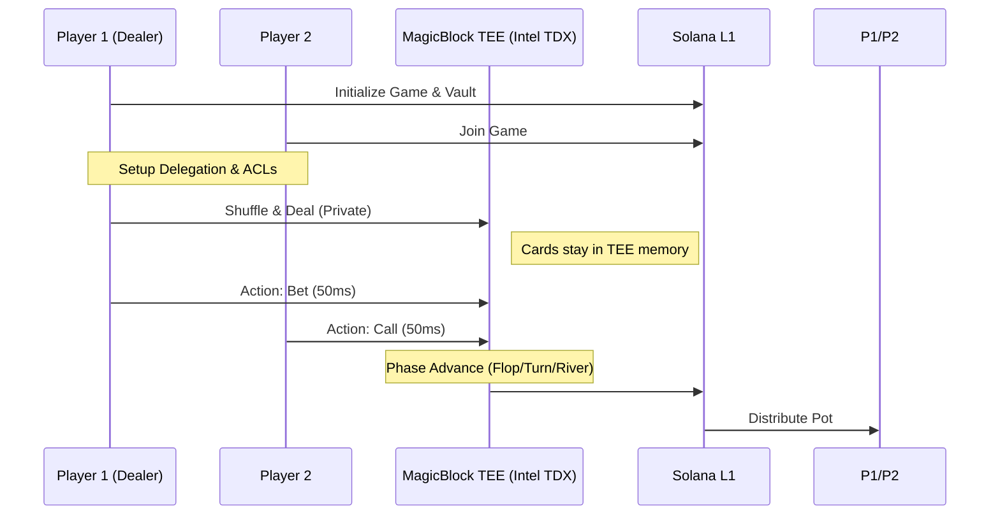

# 🛡️ Shield Poker: Privacy-Preserving Texas Hold'em

Shield Poker is a decentralized, P2P Texas Hold'em game built on Solana. It leverages **MagicBlock's Private Ephemeral Rollups (PER)** to solve the "on-chain leakage" problem, keeping player hands absolutely private while maintaining 50ms execution speeds for real-time betting.

---

## 📺 Project Presentation
<!-- slide -->
> [!NOTE]
> ### 🎥 Demo Video
> [](https://www.youtube.com/watch?v=PLACEHOLDER_VIDEO_ID)
> *Watch our 3-minute technical walkthrough and game demo.*

---

## 📸 Screenshots
````carousel

<!-- slide -->

<!-- slide -->

````

---

## 🎯 The Problem
On standard blockchains, all state is public. For games like Poker, this is a non-starter:
1. **Card Privacy**: If your hand is on-chain, anyone can see it.
2. **Latency**: Waiting 400ms - 2s for every bet kills the game flow.
3. **Cost**: Transaction fees for every "Check" or "Small Bet" add up quickly.

## 🏗️ The Solution: MagicBlock PER
Shield Poker moves the sensitive game logic into a hardware-secured **Trusted Execution Environment (TEE)** using **Intel TDX**. 

### **Technical Deep Dive**

#### **1. Real-Time Privacy (Intel TDX TEE)**
The game logic runs within a TEE validator. This ensures that even the validator operator cannot peek at the memory where player hands are processed. We use the `#[ephemeral]` attribute to mark accounts that should exist primarily in the TEE for speed.

#### **2. Protocol-Level Access Control (ACL)**
Instead of just client-side encryption, Shield Poker uses MagicBlock's **Permission Program (ACL)**:
- **Public Accounts**: The `Game` account (pot, community cards) has a public ACL.
- **Private Accounts**: Each `PlayerState` (holding the hole cards) is protected by a restricted ACL. Only the specific player holding the corresponding TEE authorization token can read their own state.

#### **3. Fast State Settlement**
By delegating accounts to the TEE, we achieve **~50ms execution**. Once the "Showdown" occurs, the `commit_game` instruction triggers a state settlement:
- Final winner is determined in the TEE.
- The state is "committed" and "undelegated" back to Solana L1.
- Funds are distributed from the L1 Vault.

---

## 🚀 Architecture Diagram



---

## 🛠️ Getting Started

### Prerequisites
- Solana CLI & Anchor 0.32.1
- MagicBlock TEE Authorized Wallet

### Installation
1. **Clone the repo**
2. **Setup Program**:
   ```bash
   anchor build
   anchor deploy
   ```
3. **Launch Frontend**:
   ```bash
   cd app
   npm install
   npm run dev
   ```

---

## 🏆 Hackathon Submission
This project is submitted for the **Privacy Hack 2026** in the **MagicBlock Track**.

### **Key Innovations**
- **Zero-Leaking Hands**: Hands are never visible on L1 Explorers.
- **Instant Betting**: Real-time feedback loop without waiting for L1 finality.
- **Hybrid Security**: Trustless L1 settlement for funds, TEE privacy for game logic.

---

## 📄 License
MIT © 2026 Shield Poker Team
