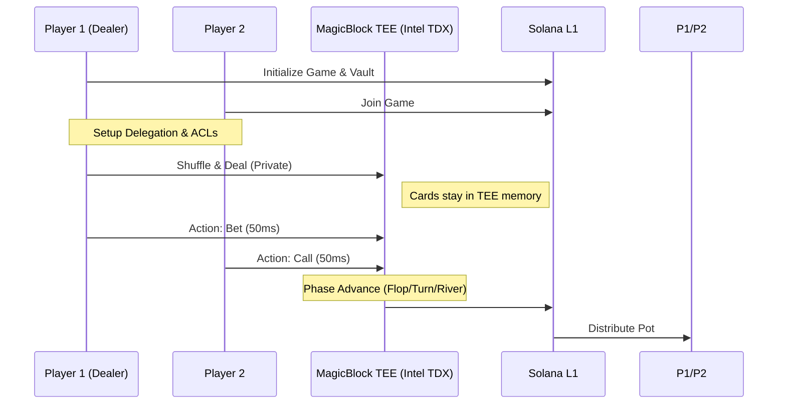

# 🛡️ Shield Poker: Privacy-Preserving Poker with On-Chain Social Identity

Live Project Link: [https://shield-poker.vercel.app/](https://shield-poker.vercel.app/)

Shield Poker is a decentralized, P2P Texas Hold'em game built on Solana. It solves the "on-chain leakage" problem using **MagicBlock's Ephemeral Rollups (TEE)** for private gameplay and **Tapestry Protocol** for a persistent, decentralized social layer.

---
## 🎮 Key Features

### 1. Cryptographic Privacy (Powered by MagicBlock)
- **Zero-Leaking Hands**: Player hole cards are processed within a **Trusted Execution Environment (TEE)** using Intel TDX. Cards are never visible on L1 Explorers.
- **Lightning Speed**: Experience **~50ms execution** for betting, checking, and folding—eliminating L1 latency.
- **Trustless Settlement**: Funds are held in an L1 Vault and only dispersed after the TEE securely settles the game outcome.

### 2. Social & Reputation Layer (Powered by Tapestry)
- **Persistent Player Profiles**: Every player has a unique Tapestry identity with a username, bio, and avatar.
- **Career Stats Tracking**: Performance is recorded on-chain. Profiles keep a permanent record of `total_games_played`, `games_won`, and `games_lost`, updated automatically upon game resolution.
- **Decentralized In-Game Chat**: A real-time chat system built on Tapestry's social graph. Each game creates a "Content" thread where player messages are pushed as "Comments," ensuring a censorship-resistant table banter.

---
## 📺 Project Demo

### 🎥 Presentation Video
[Watch the Demo](https://drive.google.com/file/d/14YcDFWejDX3U-uRmo3FxuUtVDqCmWaf-/view?usp=drive_link)

### 📸 Product Screenshots

<div align="center">
  <p><b>1. Poker Lobby & Profiles</b></p>
  
  <br>
  <p><i>Browse live games and view player reputations via the Tapestry badge.</i></p>
  
  <p><b>2. Private Gameplay & Chat</b></p>
  
  <br>
  <p><i>Joined players can chat and take actions such as fold, check, call or bet amount.</i></p>

  <p><b>2. Game Result/Showdown Phase</b></p>
  
  <br>
  <p><i>See which player won and how much</i></p>


</div>

---

## 🎯 The Problem
On standard blockchains, all state is public. For games like Poker, this is a non-starter:
1. **Card Privacy**: If your hand is on-chain, anyone can see it.
2. **Latency**: Waiting 400ms - 2s for every bet kills the game flow.
3. **Cost**: Transaction fees for every "Check" or "Small Bet" add up quickly.

## 🏗️ The Solution: MagicBlock PER
Shield Poker moves the sensitive game logic into a hardware-secured **Trusted Execution Environment (TEE)** using **Intel TDX**. 

### **Technical Deep Dive**

#### **1. Real-Time Privacy (Intel TDX TEE)**
The game logic runs within a TEE validator. This ensures that even the validator operator cannot peek at the memory where player hands are processed. We use the `#[ephemeral]` attribute to mark accounts that should exist primarily in the TEE for speed.

#### **2. Protocol-Level Access Control (ACL)**
Instead of just client-side encryption, Shield Poker uses MagicBlock's **Permission Program (ACL)**:
- **Public Accounts**: The `Game` account (pot, community cards) has a public ACL.
- **Private Accounts**: Each `PlayerState` (holding the hole cards) is protected by a restricted ACL. Only the specific player holding the corresponding TEE authorization token can read their own state.

#### **3. Fast State Settlement**
By delegating accounts to the TEE, we achieve **~50ms execution**. Once the "Showdown" occurs, the `commit_game` instruction triggers a state settlement:
- Final winner is determined in the TEE.
- The state is "committed" and "undelegated" back to Solana L1.
- Funds are distributed from the L1 Vault.

---

## 🚀 Architecture Diagram



## 🏗️ Technical Architecture

### **MagicBlock PER (Private Ephemeral Rollups)**
Shield Poker uses the `#[ephemeral]` attribute to mark sensitive game accounts.
- **Access Control**: Each `PlayerState` is protected by a restricted ACL. Only the authorized player can read their own hole cards within the TEE.
- **Two-Phase Commit**: 
    1. **TEE Phase**: Cards are dealt, and betting occurs at high speed.
    2. **L1 Phase**: Once the game concludes, the TEE settles the state back to Solana L1 for fund distribution.

### **Tapestry Social Graph**
- **Idempotent Stats**: Game results are pushed to Tapestry using a secure RESTful API, ensuring career stats are updated exactly once per game resolution.
- **Chat Workaround**: Tapestry "Content" represents the Game Table, and "Comments" represent the real-time messages, creating a fully on-chain chatroom without a dedicated chat protocol.


---

## 🚀 Getting Started

### Prerequisites
- Solana CLI & Anchor 0.32.1
- MagicBlock TEE Authorized Wallet
- Tapestry API Credentials

### Installation
1. **Clone the repo**
2. **Setup Program**:
   ```bash
   anchor build
   anchor deploy
   ```
3. **Frontend Configuration**:
   Create a `.env.local` in `app/`:
   ```env
   NEXT_PUBLIC_TAPESTRY_API_KEY=your_key
   NEXT_PUBLIC_TAPESTRY_API_URL=https://api.tapestry.com
   RPC_URL=your_rpc
   ```
4. **Launch**:
   ```bash
   cd app
   npm install
   npm run dev
   ```

---

## 🏆 Hackathon Submission
This project is submitted for the following tracks:

- **MagicBlock Track**: For pioneering TEE-based private gaming on Solana.
- **Tapestry Track**: For building a comprehensive on-chain social layer including profiles, career stats, and decentralized chat.

### **Key Innovations**
- **The "Invisible" Hand**: First poker game where cards are cryptographically hidden but execution is instant.
- **Persistent Professionalism**: Tapestry integration ensures players carry their reputation from table to table.
- **Consolidated UX**: A unified workflow that handles TEE authorization and game mechanics in a single, intuitive interface.

---

## 📄 License
MIT © 2026 Shield Poker Team

